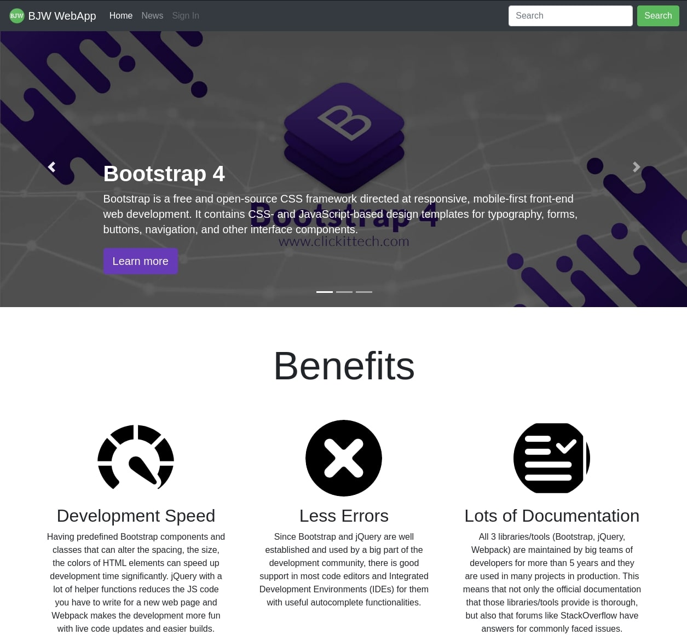

# BJW-WebApp
A simple Web Application created using Bootstrap 4, jQuery 3 and Webpack 5.

## Features
* Use of HTML, CSS, JS, Bootstrap, jQuery and Webpack technologies
* Bootstrap carousel dedicated to showcase Bootstrap, jQuery and Webpack
* Show the benefits of each technology
* Present tech news on dedicated News page
* Use of navbar, carousel, modal and footer elements
* Use of jQuery logic and custom css

## Screenshots
<h3 align="center">Home Page</h3>
<p align="center">
 </br>

</br>

<h3 align="center">News Page</h3>

</p>

## Development
Runs development page on **localhost:5000** using the command:

```
$ npm run dev
```

## Build
Builds the web app for production in the **dist** folder using the command:

```
$ npm run build
```

## Deploy
Deploys the production web app from the **dist** folder in Github Pages:

```
$ npm run deploy
```

## Author
[Evdoxia Deligianni](https://github.com/evideli)

## Version
1.0
